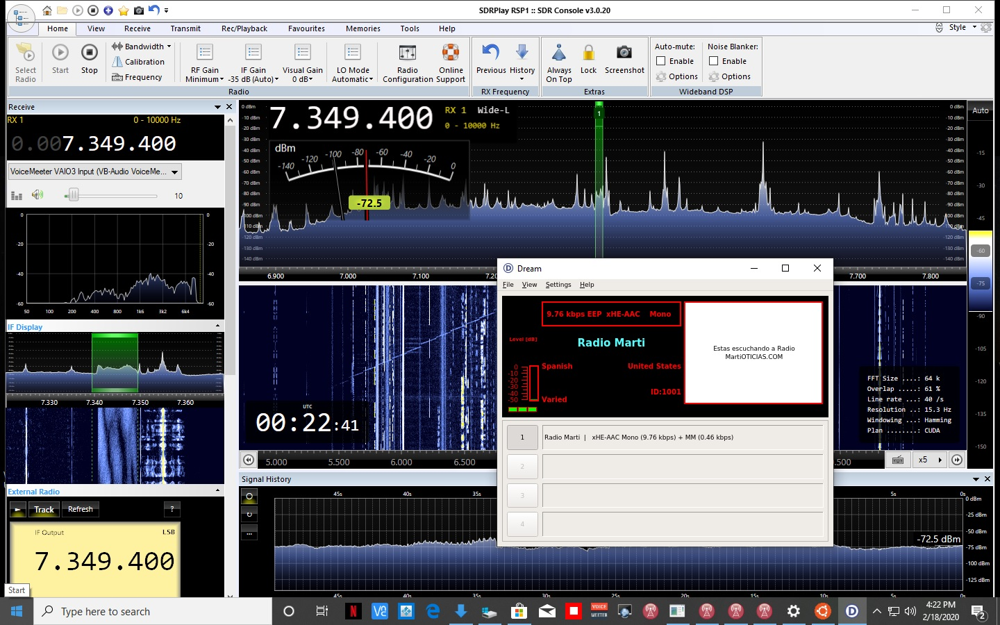

ONLY TESTED ON UBUNTU 18.04. May work on other Debian distributions.

THE SOFTWARE IS PROVIDED "AS IS", WITHOUT WARRANTY OF ANY KIND, EXPRESS OR IMPLIED, INCLUDING BUT NOT LIMITED TO THE WARRANTIES OF MERCHANTABILITY, FITNESS FOR A PARTICULAR PURPOSE AND NONINFRINGEMENT.

* fdk-aac
* dream xHE-AAC fork

To run this script in a terminal run:

chmod u+x DreamBuildUbuntu1804.sh

sudo ./DreamBuildUbuntu1804.sh

Optionally you may remove the build directory after installation with:

sudo rm -rf /opt/dreambuild

Due to a bug pulseaudio support currently requires a workaround. For all installations initially run with:

dream -I default -O default

Manage audio settings in pulseaudio with for example pavucontrol

# Instructions for setting up in Windows Subsystem for Linux (WSL)

# Installing WSL for Windows 10
# https://docs.microsoft.com/en-us/windows/wsl/install-win10

# Install Ubuntu 18.04 or your preference from the Microsoft Store

# Enabling graphics
# https://virtualizationreview.com/articles/2017/02/08/graphical-programs-on-windows-subsystem-on-linux.aspx

# Enabling sound
# DO NOT edit Line 42 in step 3. Instead run Pulseaudio as Administrator for record permission.
* Poor security work-around needs alternative

# https://token2shell.com/howto/x410/enabling-sound-in-wsl-ubuntu-let-it-sing/

# Serial ports, real or virtual. Enter full device path in Dream's rig com port i.e. /dev/ttyS5
# https://www.scivision.dev/usb-tty-windows-subsystem-for-linux/

